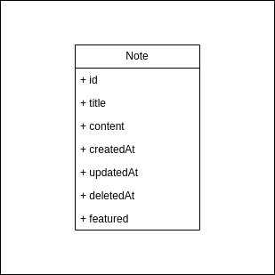

# Architecture

# 1. High level design

The application will have two components:

### Frontend

This is the interface where the user will be able to create and view all of his notes.

There will be a blank text area, with a blank title. The user don’t have to click on any button to save a new or to edit a note. The saving should be done automatically, allowing user to save their work even if they close the browser.

Stack: React or Angular

### Backend

This component has to handle all requests to save and retrieve notes. If the application receives a lot of requests that overload the database, it might be interesting to have a layer for caching, allowing to save the content of notes while users are editing them.

# 2. Web App UI

TODO

# 3. Data model

# 4. Restful API

The web application will call the back end via REST APIs. Once logged in, the user will have a token to identify each request, to guarantee the authorization to reach the resources. Each action would be identified by the respective HTTP action (GET, POST, PUT, DELETE, etc.), unless the operation requested is too specific and doesn’t contemplate an HTTP action for that purpose.

For this simple web app, these basic endpoints will be enough.

| HTTP Action | URL | Description |
| --- | --- | --- |
| GET | /notes | Get all notes from the user. |
| GET | /notes/{id} | Get a note from the user by ID. |
| GET | /notes/filter?value={value} | Filter notes from that user that have that specific value in title or text. |
| POST | /notes | Create a new note for that user. |
| PUT | /notes/{id} | Update a note with the specific ID for that user. |
| DELETE | /notes/{id} | Delete a note with the specific ID for that user. |

### How would the web app get the user’s notes?

| METHOD HTTP | GET |
| --- | --- |
| URL | /notes |
| Description | API to get all notes from user. The verification of the user would be done by a token. |

### How would the web app save a user note?

| Method HTTP | POST |
| --- | --- |
| URL | /notes |
| Description | Create a note for a specific User. The verification of the user would be done by a token. |

### What are the URL for the note resource(s)?

| Method HTTP | POST |
| --- | --- |
| URL | /notes |
| Description | Create a note for a specific User. The verification of the user would be done by a token. |

# 5. Web Server

For this application, an MVC back end will serve well. We will have 3 layers, the first one being the Controller to receive all requests. The next will be the Service layer, responsible for all business logic. The third will be the data layer, responsible to connect to the database.

Some operations, such as get note by ID, are simple. They just need to have the inputs validated before retrieving or updating the resource.

### Get notes

When getting all notes, they should be sorted by when they were last updated (`updatedAt`), to guarantee that the notes the user is working on will appear first.

### Filter Notes

When filtering the notes, the user must be able to filter notes not only by the Title, but also by its content.

### Delete notes

The deletion of a note should be done softly, allowing the user to roll back that action for any reason.

### Database choice

To allow for an effective search, the best type of database to store notes are document based databases. For this purpose, MongoDB or Elasticsearch are a good fit.

One problem for this application might occur if it has a lot of transactions in a short period of time. In this case, to prevent a lot of saving in the database while a user is writing a note, it could be interesting to have another layer for caching the modifications. This could be done using Redis.